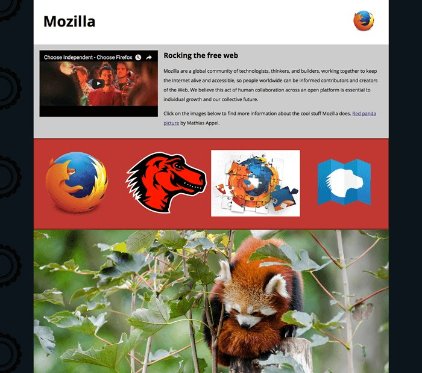

# Examen 3 HTML Ruben Lechosa Cervantes
## Descripción de la practica

En esta practica lo que debemos hacer es descargar la base que nos ha proporcionado el professor y hacer lo mismo que en la siguiente imagen:

subir el examen en un repositorio en GitHub y hacer un README.md con la explicación de la practica

## Ejecución

Cuando tengamos la pagina web debemos transformarla a formato responsive para que la web se adapte  atodo tipo de dispositivos, como en la siguiente imagen:

También tenemos que separar el **style** del .html y hacer un .css aparte

## ¿Que necesitamos?

1. Visual Sudio Code
2. Base del trabajo <a href="https://github.com/mdn/learning-area/tree/master/html/multimedia-and-embedding/mdn-splash-page-start">Descargar</a>
3. Instrucciones de la practica <a href="https://www.mediafire.com/file/illa1ioy9qv7v2e/Examen_3_Parte_P%25C3%25A1gina_de_presentaci%25C3%25B3n_de_Mozilla.docx/file">Descargar</a>
4. Cuenta en GitHub

## Como hacerlo

Lo primero que debemos hacer es descargar Visual Studio Code, El word con las instrucciones de la practica y la plantilla para hacerlo, después tenemos que separar el **style** en un nuevo archivo .css, lo podemos hacer de la siguiente manera para linckearlo: <link rel="stylesheet" href="style.css"> 

